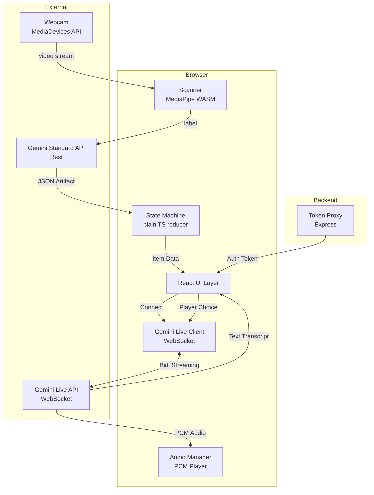
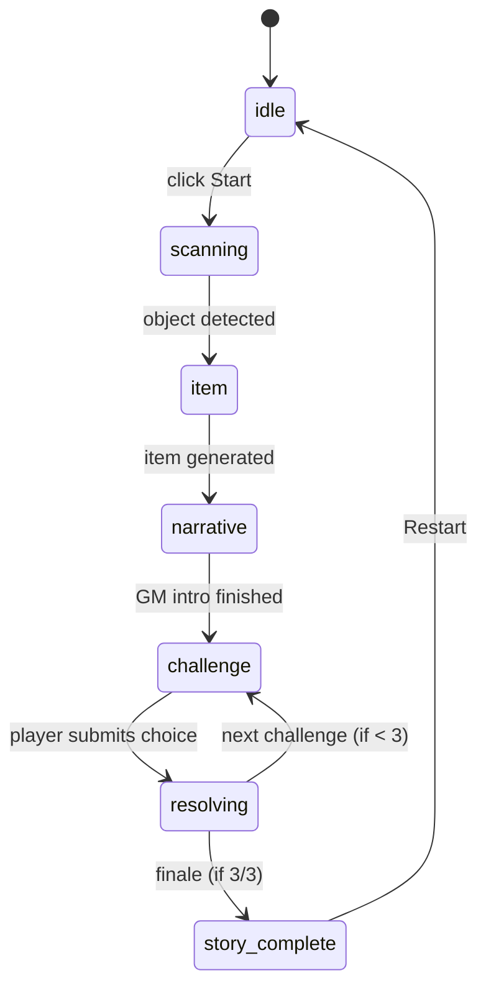

# Design Document — The Wrong Room

## Overview

"The Wrong Room" is a browser-based, AI-powered interactive dungeon game built with **Vite + React + TypeScript** and a lightweight **Node.js/Express** backend. A player scans a real-world object via webcam; MediaPipe detects it in-browser, the Gemini API transforms it into a magical artifact, and the player uses that artifact to navigate a three-stage narrative journey guided by a real-time, voice-enabled AI Dungeon Master.

The game leverages the **Gemini Live API (Multimodal Live)** via WebSockets to provide an immersive, low-latency storytelling experience with full audio streaming.

## Architecture



### Key Design Decisions

- **Backend Token Proxy**: Instead of exposing the Gemini API key in the frontend, a lightweight Express backend fetches/proxies credentials. This ensures security while allowing the frontend to use the SDK natively.
- **Local Configuration**: Environment variables (`.env.local`) are stored in the `backend` folder where they are natively loaded by the server.
- **Gemini Live API (WebSockets)**: Chosen over standard REST calls for the narrative phases to enable real-time audio streaming and seamless "conversational" interaction with the Dungeon Master.
- **SysAdmin Persona**: The Dungeon Master is characterized as a sleep-deprived sysadmin trapped in the magic room after a Friday night prod outage. This theme ties together the tech/magic aesthetic.
- **MediaPipe ObjectDetector (WASM)**: Runs entirely in-browser, ensuring the object scanning phase is fast and private.
- **Framer Motion**: Powering the "premium" feel with smooth transitions between game phases and dynamic background ambience that reacts to the current artifact's "element" (Combat, Utility, Magic).

---

## Game Flow & State Machine

### Phase Flow



### State Machine Interfaces

```typescript
type Phase = "idle" | "scanning" | "item" | "narrative" | "challenge" | "resolving" | "story_complete";

interface GameState {
  phase: Phase;
  scannedLabel: string | null;
  generatedItem: ProcessedArtifact | null;
  challengeStep: number;        // Tracks 1, 2, or 3
  isComplete: boolean;
}

type GameAction =
  | { type: "START_SCAN" }
  | { type: "OBJECT_DETECTED"; label: string }
  | { type: "ITEM_GENERATED"; item: ProcessedArtifact }
  | { type: "NARRATIVE_DONE" }
  | { type: "SUBMIT_CHOICE" }
  | { type: "NEXT_CHALLENGE" }
  | { type: "END_STORY" };
```

---

## Core Systems

### 1. Object Scanning (MediaPipe)
The `Scanner` component uses MediaPipe's `ObjectDetector` to identify items in the real world. Once an item (e.g., "cell phone") is detected and confirmed, the system transitions to the generation phase.

### 2. Artifact Generation (Gemini Standard API)
We use a standard Gemini REST call with a strict JSON schema to "forge" the detected object into a game-ready artifact.
- **Mechanic Tags**: Each item is assigned a tag (`combat`, `utility`, `magic`) which determines the UI color palette and how the GM interprets the player's choices.

### 3. Live Storytelling (Gemini Live API)
The narrative is handled by the `GeminiLiveSession` class.
- **WebSocket Connection**: Established once the artifact is ready.
- **Bimodal Output**: Receives both text transcripts (for the UI) and PCM audio data (played via `AudioContext`).
- **Context Management**: The prompt history is maintained within the Live session to ensure the DM remembers previous choices across the 3 challenges.

### 4. Audio Processing
A dedicated `audioPlayer` utility handles the queuing and playback of base64-encoded PCM chunks received from the Gemini Live API, ensuring smooth, uninterrupted speech.

---

## Project Structure

```
/
├── backend/            — Express server (token management)
│   ├── .env.local      — Local Secrets (ignored by git)
│   └── index.ts
├── frontend/           — React + Vite + Tailwind
│   ├── src/
│   │   ├── components/ — Scanner, ItemCard, NarrativePhase, etc.
│   │   ├── lib/        — geminiLive, tokenManager, audioPlayer, stateMachine
│   │   └── App.tsx     — Main game loop & router
│   └── vercel.json
└── README.md           — Setup & Local Dev guide
```

---

## Logic & Correctness

1. **3-Challenge Loop**: The state machine enforces exactly 3 challenges. The transition from `resolving` back to `challenge` increments the `challengeStep`.
2. **Deterministic Outcomes**: While the narrative is dynamic, the transition to the `story_complete` phase is strictly based on the completion of the 3rd challenge resolution.
3. **Graceful Disconnection**: The `GeminiLiveSession` includes hooks for `onClosed` and `onError` to reset the game state if the WebSocket connection is interrupted, preventing the UI from getting stuck.
4. **Environment Safety**: The backend ensures the `GEMINI_API_KEY` is never hardcoded or sent to the client as a raw string in a production-like environment (abstracted via the `token` endpoint).
